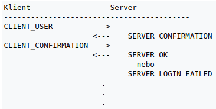
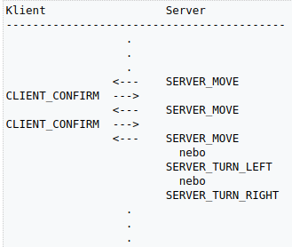
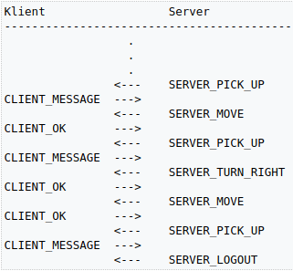
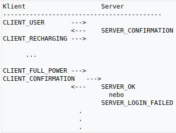
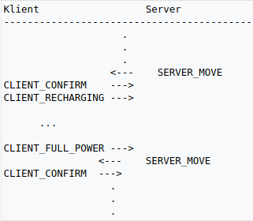
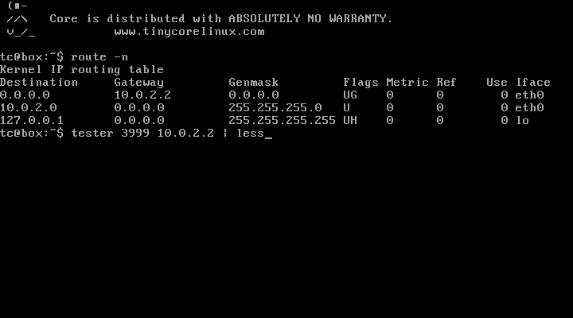

# TCP server #

## Anotace ##

Cílem úlohy je vytvořit vícevláknový server pro TCP/IP komunikaci a implementovat komunikační protokol podle dané specifikace.

`Před začátkem implementace si prostudujte poznámky k odevzdání! Ušetříte si budoucí komplikace.`

## Zadání ##

Vytvořte server pro automatické řízení vzdálených robotů. Roboti se sami přihlašují k serveru a ten je navádí k cílové lokaci v souřadnicové síti. Pro účely testování každý robot startuje na náhodných souřadnicích a jeho cílová oblast se nachází vždy od -2 do 2 na ose X i na ose Y. Někde v cílové oblasti se nachází tajná zpráva, kterou robot musí najít, takže je nutné prohledat všechna políčka cílové oblasti. Server zvládne navigovat více robotů najednou a implementuje bezchybně komunikační protokol.

## Detailní specifikace ##

Komunikace mezi serverem a roboty je realizována plně textovým protokolem. Každý příkaz je zakončen dvojicí speciálních symbolů „\a\b“. Server musí dodržet komunikační protokol do detailu přesně, ale musí počítat s nedokonalými firmwary robotů (viz sekce Speciální situace).

Zprávy serveru:

| **Název** | **Zpráva** | **Popis** |
| ----- | ------ | ----- |
| SERVER_CONFIRMATION | <16-bitové číslo v decimální notaci>\a\b | Zpráva s potvrzovacím kódem. Může obsahovat maximálně 5 čísel a ukončovací sekvenci \a\b. |
| SERVER_MOVE |	102 MOVE\a\b | Příkaz pro pohyb o jedno pole vpřed |
| SERVER_TURN_LEFT	| 103 TURN LEFT\a\b | Příkaz pro otočení doleva |
| SERVER_TURN_RIGHT | 104 TURN RIGHT\a\b | Příkaz pro otočení doprava |
| SERVER_PICK_UP | 105 GET MESSAGE\a\b | Příkaz pro vyzvednutí zprávy |
| SERVER_LOGOUT | 106 LOGOUT\a\b | Příkaz pro ukončení spojení po úspěšném vyzvednutí zprávy |
| SERVER_OK | 200 OK\a\b | Kladné potvrzení |
| SERVER_LOGIN_FAILED |	300 LOGIN FAILED\a\b | Nezdařená autentizace |
| SERVER_SYNTAX_ERROR |	301 SYNTAX ERROR\a\b | Chybná syntaxe zprávy |
| SERVER_LOGIC_ERROR | 302 LOGIC ERROR\a\b | Zpráva odeslaná ve špatné situaci |

Zprávy klienta:

| **Název** | **Zpráva** | **Popis** | **Ukázka** | **Maximální délka** |
| ----- | ------ | ----- | ------ | --------------- |
| CLIENT_USERNAME | <user name>\a\b | Zpráva s uživatelským jménem. Jméno může být libovolná sekvence znaků kromě kromě dvojice \a\b. | Umpa_Lumpa\a\b | 12 |
| CLIENT_CONFIRMATION | <16-bitové číslo v decimální notaci>\a\b | Zpráva s potvrzovacím kódem. Může obsahovat maximálně 5 čísel a ukončovací sekvenci \a\b. | 1009\a\b | 7 |
| CLIENT_OK | OK <x> <y>\a\b | Potvrzení o provedení pohybu, kde x a y jsou souřadnice robota po provedení pohybového příkazu. | OK -3 -1\a\b | 12 |
| CLIENT_RECHARGING | RECHARGING\a\b | Robot se začal dobíjet a přestal reagovat na zprávy. | 12 |
| CLIENT_FULL_POWER | FULL POWER\a\b | Robot doplnil energii a opět příjímá příkazy. | 12 |
| CLIENT_MESSAGE | <text>\a\b | Text vyzvednutého tajného vzkazu. Může obsahovat jakékoliv znaky kromě ukončovací sekvence \a\b. | Haf!\a\b | 100 |

Časové konstanty:

| **Název** | **Hodota [s]** | **Popis** |
| ----- | ---------- | ----- |
| TIMEOUT | 1 |	Server i klient očekávají od protistrany odpověď po dobu tohoto intervalu. |
| TIMEOUT_RECHARGING | 5 | Časový interval, během kterého musí robot dokončit dobíjení. |

Komunikaci s roboty lze rozdělit do několika fází:

## Autentizace ##

Server i klient oba znají dvojici autentizačních klíčů (nejedná se o veřejný a soukromý klíč):

* Klíč serveru: 54621
* Klíč klienta: 45328

Každý robot začne komunikaci odesláním svého uživatelského jména. Uživatelské jméno múže být libovolná sekvence znaků neobsahující sekvenci „\a\b“. Server z uživatelského hesla spočítá hash kód:

`Uživatelské jméno: Mnau!`

`ASCII reprezentace: 77 110 97 117 33`

`Výsledný hash: ((77 + 110 + 97 + 117 + 33) * 1000) % 65536 = 40784`

Výsledný hash je 16-bitové číslo v decimální podobě. Server poté k hashi přičte klíč serveru tak, že pokud dojde k překročení kapacity 16-bitů, hodnota jednoduše přeteče:

`(40784 + 54621) % 65536 = 29869`

Výsledný potvrzovací kód serveru se jako text pošle klintovi ve zprávě SERVER_CONFIRM. Klient z obdrženého kódu vypočítá zpátky hash a porovná ho s očekávaným hashem, který si sám spočítal z uživatelského jména. Pokud se shodují, vytvoří potvrzovací kód klienta a odešle jej zpátky serveru. Výpočet potvrzovacího kódu klienta je obdobný jako u serveru, jen se použije klíč klienta:

`(40784 + 45328) % 65536 = 20576`

Potvrzovací kód klienta se odešle serveru ve zpráve CLIENT_CONFIRMATION, který z něj vypočítá zpátky hash a porovná jej s původním hashem uživatelského jména. Pokud se obě hodnoty shodují, odešle zprávy SERVER_OK, v opačném prípadě reaguje zprávou SERVER_LOGIN_FAILED a ukončí spojení. Celá sekvence je na následujícím obrázku:

Server dopředu nezná uživatelská jména. Roboti proto mohou zvolit jakékoliv jméno, ale musí znát klíč klienta i serveru. Dvojice klíčů zajistí oboustranou autentizaci a zároveň zabrání, aby byl autentizační proces kompromitován prostým odposlechem komunikace.

## Pohyb robota k cílové oblasti ##

Robot se může pohybovat pouze rovně (SERVER_MOVE) a je schopen provést otočení na místě doprava (SERVER_TURN_RIGHT) i doleva (SERVER_TURN_LEFT). Po každém příkazu k pohybu odešle potvrzení (CLIENT_OK), jehož součástí je i aktuální souřadnice. Pozor - roboti jsou v provozu již dlouhou dobu, takže začínají chybovat. Občas se stane, že se nepohnou kupředu. Tuto situaci je třeba detekovat a správně na ni zareagovat! Pozice robota není serveru na začátku komunikace známa. Server musí zjistit polohu robota (pozici a směr) pouze z jeho odpovědí. Z důvodů prevence proti nekonečnému bloudění robota v prostoru, má každý robot omezený počet pohybů (posunutí vpřed i otočení). Počet pohybů by měl být dostatečný pro rozumný přesun robota k cíli. Následuje ukázka komunkace. Server nejdříve pohne dvakrát robotem kupředu, aby detekoval jeho aktuální stav a po té jej navádí směrem k cílovým souřadnicím.

Tuto částo komunikace nelze přeskočit, robot očekává alespoň jeden pohybový příkaz - SERVER_MOVE, SERVER_TURN_LEFT nebo SERVER_TURN_RIGHT!

Pozor! Roboti občas chybují a nedaří se jim vykonat pohyb vpřed. V případě, že se nepohnou z místa, je nutné to detekovat a poslat příkaz k pohybu ještě jednou. Při rotaci roboti nechybují.

## Vyzvednutí tajného vzkazu ##

Poté, co robot dosáhne cílové oblasti (jedná se o čtverec s rohovými souřadnicemi [2,2], [2,-2], [-2,2] a [-2,-2] včetně), tak začne prohledávat celou oblast, tedy pokusí vyzvednout vzkaz ze včech 25 políček cílové oblasti (SERVER_PICK_UP). Pokud je robot požádán o vyzvednutí vzkazu a nenachází se v cílové oblasti, spustí se autodestrukce robota a komunikace se serverem je přerušena. Pokud je políčko prázdné a neobsahuje vzkaz, robot odpoví prázdnou zprávou CLIENT_MESSAGE - „\a\b“. (Je garantováno, že hledaná zpráva obsahuje vždy neprázdný textový řetězec.) V opačném případě pošle serveru text vyzvednutého tajného vzkazu a server ukončí spojení zprávou SERVER_LOGOUT. (Je zaručeno, že tajný vzkaz se nikdy neshoduje se zprávou CLIENT_RECHARGING, pokud je tato zpráva serverem obdržena po žádosti o vyzvednutí jedná se vždy o dobíjení.) Poté klient i server ukončí spojení. Ukázka prohledávání cílové oblasti:

## Dobíjení ##

Každý z robotů má omezený zdroj energie. Pokud mu začne docházet baterie, oznámí to serveru a poté se začne sám ze solárního panelu dobíjet. Během dobíjení nereaguje na žádné zprávy. Až skončí, informuje server a pokračuje v činnosti tam, kde přestal před dobíjením. Pokud robot neukončí dobíjení do časového intervalu TIMEOUT_RECHARGING, server ukončí spojení.

Další ukázka:

## Chybové situace ##

Někteří roboti mohou mít poškozený firmware a tak mohou komunikovat špatně. Server by měl toto nevhodné chování detekovat a správně zareagovat.

### Chyba při autentizaci ###

Server reaguje na chybnou autentizaci zprávou SERVER_LOGIN_FAILED. Tato zpráva je poslána pouze po té, co server přijme validní zprávu CLIENT_USERNAME i CLIENT_CONFIRMATION a přijatý hash neodpovídá hashi uživatelského jména. (Validní == syntakticky korektní) V jiné situaci server zprávu SERVER_LOGIN_FAILED poslat nesmí.

### Syntaktická chyba ###

Na syntaktickou chybu reagauje server vždy okamžitě po obdržení zprávy, ve které chybu detekoval. Server pošle robotovi zprávu SERVER_SYNTAX_ERROR a pak musí co nejdříve ukončit spojení. Syntakticky nekorektní zprávy:

* Příchozí zpráva je delší než počet znaků definovaný pro každou zprávu (včetně ukončovacích znaků \a\b). Délky zpráv jsou definovány v tabulce s přehledem zpráv od klienta.
* Příchozí zpráva syntakticky neodpovídá ani jedné ze zpráv CLIENT_USERNAME, CLIENT_CONFIRMATION, CLIENT_OK, CLIENT_RECHARGING a CLIENT_FULL_POWER.
Každá příchozí zpráva je testována na maximální velikost a pouze zprávy CLIENT_CONFIRMATION, CLIENT_OK, CLIENT_RECHARGING a CLIENT_FULL_POWER jsou testovany na jejich obsah (zprávy CLIENT_USERNAME a CLIENT_MESSAGE mohou obsahovat cokoliv).

### Logická chyba ###

Logická chyba nastane pouze v jednom případě - když robot pošle info o dobíjení (CLIENT_RECHARGING) a po té pošle jakoukoliv jinou zprávu než CLIENT_FULL_POWER. Server na tuto chybu reaguje odesláním zprávy SERVER_LOGIC_ERROR a okamžitým ukončením spojení.

### Timeout ###

Protokol pro komunikaci s roboty obsahuje dva typy timeoutu:

* TIMEOUT - timeout pro komunikaci. Pokud robot nebo server neobdrží od své protistrany zprávu po dobu tohoto časového intervalu, považují spojení za ztracené a okamžitě ho ukončí.
* TIMEOUT_RECHARGING - timeout pro dobíjení robota. Po té, co server přijme zprávu CLIENT_RECHARGING, musí robot nejpozději do tohoto časového intervalu odeslat zprávu CLIENT_FULL_POWER. Pokud to robot nestihne, server musí okamžitě ukončit spojení.

## Speciální situace ##

Při komunikaci přes komplikovanější síťovou infrastrukturu může docházet ke dvěma situacím:

* Zpráva může dorazit rozdělena na několik částí, které jsou ze socketu čteny postupně. (K tomu dochází kvůli segmentaci a případnému zdržení některých segmentů při cestě sítí.)
* Zprávy odeslané brzy po sobě mohou dorazit téměř současně. Při jednom čtení ze socketu mohou být načteny obě najednou. (Tohle se stane, když server nestihne z bufferu načíst první zprávu dříve než dorazí zpráva druhá.)

Za použití přímého spojení mezi serverem a roboty v kombinaci s výkonným hardwarem nemůže k těmto situacím dojít přirozeně, takže jsou testovačem vytvářeny uměle. V některých testech jsou obě situace kombinovány.

Každý správně implementovaný server by se měl umět s touto situací vyrovnat. Firmwary robotů s tímto faktem počítají a dokonce ho rády zneužívají. Pokud se v protokolu vyskytuje situace, kdy mají zprávy od robota předem dané pořadí, jsou v tomto pořadí odeslány najednou. To umožňuje sondám snížit jejich spotřebu a zjednodušuje to implementaci protokolu (z jejich pohledu).

## Optimalizace serveru ##

Server optimalizuje protokol tak, že nečeká na dokončení zprávy, která je očividně špatná. Například na výzvu k autentizaci pošle robot pouze část zprávy s uživatelským jménem. Server obdrží např. 14 znaků uživatelského jména, ale stále neobdržel ukončovací sekvenci \a\b. Vzhledem k tomu, že maximální délka zprávy je 12 znaků, je jasné, že přijímaná zpráva nemůže být validní. Server tedy zareaguje tak, že nečeká na zbytek zprávy, ale pošle zprávu SERVER_SYNTAX_ERROR a ukončí spojení. V principu by měl postupovat stejně při vyzvedávání tajného vzkazu.

V případě části komunikace, ve které se robot naviguje k cílovým souřadnicím očekává tři možné zprávy: CLIENT_OK, CLIENT_RECHARGING nebo CLIENT_FULL_POWER. Pokud server načte část neúplné zprávy a tato část je delší než maximální délka těchto zpráv, pošle SERVER_SYNTAX_ERROR a ukončí spojení. Pro pomoc při optimalizaci je u každé zprávy v tabulce uvedena její maximální velikost.

## Ukázka komunikace ##

`C: "Umpa_Lumpa\a\b"`

`S: "15045\a\b"`

`C: "5752\a\b"`

`S: "200 OK\a\b"`

`S: "102 MOVE\a\b"`

`C: "OK 0 1\a\b"`

`S: "102 MOVE\a\b"`

`C: "OK 0 2\a\b"`

`S: "103 TURN LEFT\a\b"`

`C: "OK 0 2\a\b"`

`S: "102 MOVE\a\b"`

`C: "OK -1 2\a\b"`

`S: "102 MOVE\a\b"`

`C: "OK -2 2\a\b"`

`S: "104 TURN RIGHT\a\b"`

`C: "OK -2 2\a\b"`

`S: "104 TURN RIGHT\a\b"`

`C: "OK -2 2\a\b"` 

`S: "105 GET MESSAGE\a\b"` 

`C: "Tajny vzkaz.\a\b"`

`S: "106 LOGOUT\a\b"`

## Testování ##

K testování je připraven obraz operačního systému Tiny Core Linux, který obsahuje tester domácí úlohy. Obraz je kompatibilní s aplikací VirtualBox.

### Tester ###

Stáhněte a rozbalte obraz. Výsledný soubor spusťte ve VirtualBoxu. Po spuštění a nabootování je okamžitě k dispozici shell. Tester se spouští příkazem tester:

`tester <číslo portu> <vzdálená adresa> [čísla testů]`

Prvním parametrem je číslo portu, na kterém bude naslouchat váš server. Následuje parametr se vzdálenou adresou serveru. Pokud je váš server spuštěn na stejném počítači jako VirtualBox, použijte adresu defaultní brány. Postup je naznačen na následujícím obrázku:

Výstup je poměrně dlouhý, proto je výhodné přesměrovat jej příkazu less, ve kterém se lze dobře pohybovat.

Pokud není zadáno číslo testu, spustí se postupně všechny testy. Testy lze spouštět i jednotlivě. Následující ukázka spustí testy 2, 3 a 8:

`tester 3999 10.0.2.2 2 3 8 | less`

#### Možné problémy v operačním systému windows ####

V některých instalací OS Windows bývá problém se standardní konfigurací virtuálního stroje. Pokud se nedaří spojit tester ve virtuálce s testovaným serverem v hostitelském operačním systému, tak použijte následující postup:

* U vypnuté virtuálky s testerem změňte nastavení síťového adaptéru z NAT na Host-only network.
* V hostitelském OS by se mělo objevit síťové rozhraní patřící VirtualBoxu. To lze zjistit z příkazové řádky příkazem ipconfig. IP adresa tohoto rozhraní bude pravděpodobně 192.168.56.1/24.
* Ve virtuálce s testerem je teď nutné ručně nastavit IP adresu síťovému rozhraní eth0:
sudo ifconfig eth0 192.168.56.2 netmask 255.255.255.0

* Nyní je možné spustit tester, ale jako cílovou adresu zadejte IP adresu síťového rozhraní v hostitelském OS:
tester 3999 192.168.56.1

### Přehled testů ###

#### Ideální situace ####

Test 1 pošle validní data pro autentizaci a jeho robot se po prvním pohybu nachází na cílových souřadnicích a očekává vyzvednutí tajného vzkazu.

#### Kontrola autentizace ####

Testy 2 až 4 ověřují, zda server správně kontroluje chyby při autentizaci. (Neplatný potvrzovací kód, speciální znaky v uživatelském jméně…)

#### Kontrola ošetření speciálních situací ####

Testy 5 až 7 kontrolují správné reakce na speciální situace (segmentace a spojování zpráv).

#### Kontrola detekce syntaktických chyb ####

Testy 8 až 14 ověřují detekci syntaktických chyb.

#### Kontrola detekce komunikačního timeoutu ####

Testy 15 a 16 ověřují, zda server správně timeoutuje a ukončuje spojení.

#### Kontrola optimalizace serveru ####

Testy 17 až 21 kontrolují, zda je server správně optimalizován.

#### Kontrola navigace robota ####

Testy 20 až 24 kontrolují, zda server dokáže navést robota do cíle. Pozor! Roboti mohou chybovat a občas neprovedou posun vpřed.

#### Kontrola reakce na dobíjení robota ####

Testy 25 až 28 kontrolují, zda server správně reaguje na dobíjení robota.

#### Kontrola paralelního zpracování ####

Test 29 spustí tři testovací instance paralelně.

#### Testování náhodně generovanými situacemi ####

Test 30 vytváří validní, ale náhodně generovanou komunikaci. Tento test je použit při finálním testu.

#### Konečná kontrola ####

Tento test se spustí automaticky po úspěšném dokončení všech předchozích testů. Spustí se paralelně 3 instance testu 30.

### Ke stažení ###

Aplikace VirtualBox: https://www.virtualbox.org/wiki/Downloads

Obraz s testerm: bi-psi_2018_task1_v3.ova.zip

Binárka testeru pro linux: psi-tester-2018-t1-v3_x86.bz2

Binárka testeru pro linux (64-bitová verze): psi-tester-2018-t1-v3_x64.bz2

## Požadavky na řešení ##

* Řešení lze vytvořit v jakémkoliv programovacím jazyce, který implementuje rozhraní socketů. Pro čtení a pro zápis do socketu musí být použita funkce nebo metoda receive/send. V jazyce Java je možné použít streamované čtení a zápis přímo na socketu. Pokud si nejste jisti, napište zodpovědné osobě: viktor.cerny@fit.cvut.cz
* Přijato bude pouze řešení, které projde všemi testy.

## Odevzdání ##

Úloha je úspěšně odevzdána pouze v případě, že byl zdrojový kód nahrán na odevzdávací server a řešení bylo osobně odprezentováno na laboratorním cvičení! Datum odevzdání je určeno uploadem na odevzdávací server, prezentovat úlohu je tedy možné i po deadline a bez penalizace.

### Náhrání na archivační server ###

K odevzdávání slouží speciální server (PSI bouda). **Každý student se na něm registruje a ve vlastním zájmu bude nahrávat svá průběžná řešení (aby byla u každého dohledatelná historie, jak na svém řešení pracoval).** Na konci semestru budou všechny odevzdané zdrojové kódy otestovány na duplicitu. V případě shody dvou a více kódů mohou průběžná odevzdání pomoci odhalit viníka. **Zdrojový kód se nahrává v jednom souboru a nekomprimovaný!!!** Odevzdávací server kód nekontroluje, pouze jej porovnává s kódy ostatních studentů a vyhledává shodu. Je tedy možné spojit více zdrojových kódů do jednoho i když takový kód není potom bez úprav zkompilovatelný.

` Pište svůj kód do jediného souboru. Velmi Vám to ulehčí odevzdání.`

`Pokud máte řešení rozdělené do více souborů, stačí když jejich obsah spojíte do jednoho. Výsledný soubor nemusí být kompilovatelný, ale musí obsahovat veškerý zdrojový kód vašeho řešení.`

Link na odevzdávací server: [PSI bouda](https://bouda.felk.cvut.cz/)

`Pokud jste nenalezli svůj oblíbený jazyk v nabídce, postěžujte si zde: cernyvi2@fit.cvut.cz.`

`Pokud jste nedostali autentizační mail do 24 hodin, postěžujte si zde: cernyvi2@fit.cvut.cz.`

### Osobní prezentace ###

Probíhá na laboratorním cvičení. Student během prezentace musí prokázat, že kódu rozumí a že kód funguje. Kód, který je prezentován, musí být stejný jako ten odevzdaný na odevzdávací server. Kontrola probíhá v následujících krocích:

1. Student ukáže zdrojový kód a spustí test tak, aby bylo zřejmé, že je testován prezentovaný kód.
2. Student odpoví na kontrolní otázky ke zdrojovému kódu.
3. Student nahraje zdrojový kód na odevzdávací server tak, aby bylo zřejmé, že nahrává opravdu prezentovaný kód.

Je na každém studentovi, aby zajistil hladký průběh všech těchto kroků. Student zavolá cvičícího k prezentaci až po té, co je na ni připraven. Předpokládá se, že studenti prezentují svá řešení na svém notebooku, pokud ho nemáte k dispozici, poraďte se svým cvičícím, jak úlohu odprezentovat.
